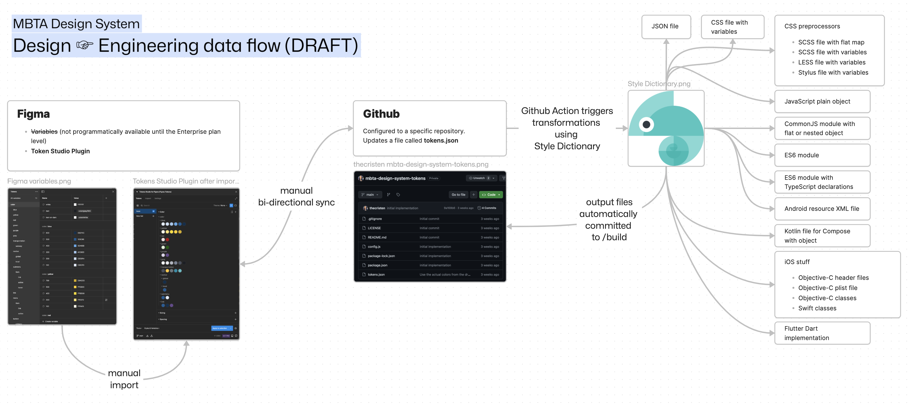

# MBTA Design System Tokens

(What are tokens?) The [U.S. Web Design System introduction to design tokens](https://designsystem.digital.gov/design-tokens/) describes design tokens ably:

> Anything we see on a website is built from elements of style: color, spacing, typography, line height, and opacity. The CSS rules associated with these elements can accept a broad continuum of values — in the case of color, there are over 16 million separate colors in the RGB color space. Font size, line height, spacing, and others can accept a similarly wide range of values.
>
> This degree of choice can slow down design work and make communication between designer and developer unnecessarily granular. The Design System seeks to maximize design efficiency and improve communication with **design tokens**: the discrete palettes of values from which we base all our visual design.

## Overview

> [!caution]
> This is very early stage work! The details are subject to change!



We seek to implement design tokens by architecting a system in which design leads can curate a "source of truth" that downstream designers and engineers can easily consume. 

> [!tip]
> This work is happening in the "MBTA Design Tokens" Figma file under "Cross-team Projects".

### Where do the token values come from?
They are artially migrated from the existing [MBTA Website Design Standards](https://zeroheight.com/2fedee66c/p/038825-mbta-website-design-standards), thoughtfully curated by our design team, and, in the case of system route colors, imported from our GTFS by route of the MBTA V3 API. 

#### Importing GTFS colors into Figma

We probably never need import this again unless we change or add a new route color. I don't _like_ the plugin I wrote, but it works. 

<details>
<summary>So I'll document it here for posterity.</summary>

Use this plugin in Figma by importing the `manifest.json` into to the "MBTA Design Tokens" Figma file in "Cross-team Projects". After import, the plugin can be invoked by menu option at `Plugins > Development > Download MBTA colors`.

```json
{
  "name": "Download MBTA colors",
  "id": "1377351509872485649",
  "api": "1.0.0",
  "main": "code.js",
  "capabilities": [],
  "enableProposedApi": false,
  "documentAccess": "dynamic-page",
  "editorType": [
    "figma"
  ],
  "networkAccess": {
    "allowedDomains": [
      "https://api-v3.mbta.com"
    ]
  },
  "permissions": ["teamlibrary"]
}
```

In my case the `code.js` is generated from this `code.ts`:

```typescript
const apiBaseUrl = "https://api-v3.mbta.com/routes?fields[route]=type,short_name,long_name,color,text_color&page[limit]=1"
const filters = {
  red: "&filter[id]=Red",
  green: "&filter[id]=Green-B",
  blue: "&filter[id]=Blue",
  orange: "&filter[id]=Orange",
  silver: "&filter[id]=746", // SLW
  bus: "&filter[id]=1",
  cr: "&filter[type]=2",
  ferry: "&filter[type]=4"
}

async function fetchColors() {
  return await Promise.all(Object.entries(filters).map(([groupName, filter]) => {
    return fetch(`${apiBaseUrl}${filter}`)
      //@ts-ignore
      .then((response) => response.json())
      .then(({data}) => {
        const { color, text_color } = data[0].attributes;
        return ({
          [`${groupName}/background`]: figma.util.rgb(color),
          [`${groupName}/text`]: figma.util.rgb(text_color),
        })
      });
  }));
}

async function init() {
  try {
    figma.notify("🚍🚇🚊⛴️ requesting MBTA system colors...");
    const localCollections = await figma.variables.getLocalVariableCollectionsAsync();
    const collection = localCollections.find(el => el.name.includes("MBTA System"));
    const defaultMode = collection.modes[0].modeId;
    if (collection) {
      const colors = await fetchColors();
      colors.forEach(color => {
        Object.entries(color).forEach(([name, value]) => {
          figma.variables
            .createVariable(name, collection, "COLOR")
            .setValueForMode(defaultMode, value);
        })
      });
      figma.notify("colors added!");
    } else {
      figma.notify("Something went wrong", {error: true});
    }
    figma.closePlugin();
  } catch (something) {
    console.error(something)
    figma.notify("Something went wrong.", {error: true});
    figma.closePlugin();
  }
}

init();
```

</details>

### Exporting tokens _from_ Figma

After defining each token as a [variable](https://help.figma.com/hc/en-us/articles/15339657135383-Guide-to-variables-in-Figma), we manually (re)import the variables into the popular [Tokens Studio](https://tokens.studio) Figma plugin (free version). This works around the fact that, as of this writing, there's no programmatic access to Figma variables at the 'Organization' price point.

The plugin is configured to sync with this very Github repository, with a push/pull just a click away!

## Building files from tokens

`build.js` contains the script which uses [Style Dictionary](https://amzn.github.io/style-dictionary/#/) to transform the generated `tokens.json` file into several different formats. 

Because we have a light and dark theme, separate files are generated for each. One theme can be used in isolation, or your application can toggle between the two.

## Using the tokens

An example page is in `/demo/index.html` using the generated CSS variables.

> [!tip]
> More to come!
